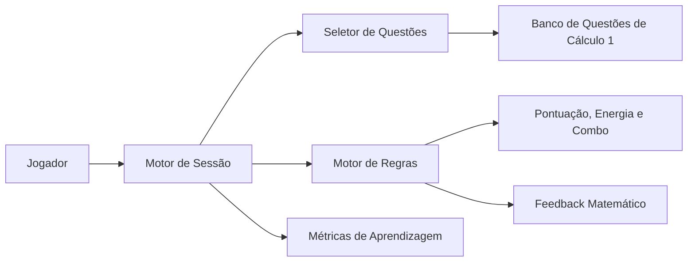

# TDD - DerivaMente: Jogo Educacional de Cálculo 1

| Campo | Valor |
|---|---|
| Projeto | DerivaMente |
| Tipo | Jogo educacional single-player |
| Disciplina | Cálculo 1 |
| Referência de design | Salen, K. & Zimmerman, E. Regras do Jogo: Fundamentos do Design de Jogos, Vol. 1 |
| Status | Draft |
| Data | 2026-05-05 |
| Público-alvo | Estudantes iniciantes de Cálculo 1 |
| Documento-base | fase1_design_do_jogo.md |

## Contexto e Definição do Problema

DerivaMente é um jogo educacional de Cálculo 1 voltado à prática ativa de limites, derivadas e integrais. O jogo parte da ideia de que o estudante aprende melhor quando precisa tomar decisões matemáticas frequentes, receber retorno imediato e perceber com clareza a consequência de seus erros. A estrutura lúdica transforma exercícios tradicionais em desafios curtos, mensuráveis e repetíveis.

O problema educacional tratado é a dificuldade de estudantes iniciantes em converter exposição teórica em desempenho procedimental e conceitual. Em Cálculo 1, muitos erros recorrentes surgem por aplicação mecânica de regras sem compreensão: substituição direta em limites indeterminados, erro de sinal em derivadas, confusão entre antiderivada e integral definida, uso incorreto da regra da cadeia e leitura superficial de gráficos. O jogo deve tornar esses erros visíveis, diagnosticáveis e corrigíveis durante a própria experiência.

### 1. Definição Formal

| Elemento | Definição no DerivaMente | Justificativa para aprendizagem de cálculo |
|---|---|---|
| Jogador | Um estudante por sessão, sem adversário humano. | A experiência individual reduz comparação social e permite que o aluno pratique no próprio ritmo. |
| Conflito artificial | Resolver problemas de cálculo sob limite de tempo, energia finita e progressão de dificuldade. | O conflito representa a tensão real entre compreender o conceito, escolher o procedimento correto e executar com precisão. |
| Regras | Regras públicas para resposta, tempo, pontuação, energia, dicas, combo e progressão. | Regras explícitas reduzem ambiguidade cognitiva: o estudante sabe o que precisa demonstrar em cada rodada. |
| Resultado quantificável | Pontuação final, energia restante, acertos por tópico, tempo médio e classificação de desempenho. | O resultado deixa de ser apenas "acertei/errei" e passa a indicar padrões de domínio e lacunas conceituais. |

### 2. Objetivos

| Nível de objetivo | Objetivo | Justificativa para aprendizagem de cálculo |
|---|---|---|
| Rodada | Identificar ou construir a resposta correta para um problema de cálculo antes do tempo expirar. | Cada rodada exige recuperação ativa, estratégia de resolução e decisão matemática concreta. |
| Nível | Completar um conjunto temático mantendo energia maior que zero. | A organização por tópico favorece consolidação gradual: primeiro limites, depois derivadas, depois integrais. |
| Sessão | Maximizar pontuação e precisão com menor dependência de dicas. | O aluno é incentivado a desenvolver autonomia, não apenas avançar por tentativa e erro. |
| Aprendizagem | Melhorar domínio conceitual e fluência procedimental em Cálculo 1. | A meta final não é só vencer o jogo, mas demonstrar evolução observável em conceitos centrais da disciplina. |

## Escopo

### Em Escopo

- Banco inicial de questões de limites, derivadas e integrais.
- Rodadas com múltipla escolha e possibilidade futura de resposta numérica.
- Sistema de energia, cronômetro, pontuação, combo e dicas.
- Feedback imediato com explicação matemática após acerto ou erro.
- Progressão por níveis e classificação final de desempenho.
- Métricas de aprendizagem por tópico, subtópico e tipo de erro.

### Fora de Escopo

- Modo multiplayer competitivo.
- Geração automática ilimitada de questões por inteligência artificial.
- Integração com ambiente acadêmico externo ou diário de notas.
- Avaliação formal substituindo prova ou lista oficial.
- Conteúdos além de Cálculo 1, como séries, equações diferenciais ou álgebra linear.

## Solução Técnica

A solução propõe um jogo em tela única, orientado por sessões curtas. O núcleo técnico é um motor de rodada que seleciona questões, controla tempo, avalia resposta, aplica regras de pontuação e registra métricas. A camada pedagógica aparece nos metadados das questões: tópico, subtópico, dificuldade, erro esperado, dica e explicação.



### 3. Sistema

O sistema é composto por interações entre jogador, questões, níveis, recursos e feedback. Cada rodada é um pequeno sistema fechado: o jogador recebe um problema, toma uma decisão, o motor de regras calcula o resultado e o feedback reorienta a próxima ação.

Justificativa para cálculo: Cálculo 1 é sistêmico por natureza. Limite, derivada e integral não são tópicos isolados; eles formam uma sequência conceitual. Representar o jogo como sistema ajuda a transformar esse encadeamento em progressão jogável.

### 4. Componentes

| Componente | Responsabilidade | Justificativa para aprendizagem de cálculo |
|---|---|---|
| Jogador | Mantém estado da sessão: pontuação, energia, nível, combo e histórico. | Permite personalizar o diagnóstico do aluno pela trajetória, não só pelo resultado final. |
| Questão | Armazena enunciado, alternativas, resposta correta, tópico, dificuldade, dica e explicação. | Questões com metadados permitem detectar se o erro foi conceitual, algébrico, procedimental ou de leitura. |
| Nível | Agrupa questões por tópico e dificuldade. | A progressão evita misturar conceitos antes da consolidação mínima. |
| Cronômetro | Impõe limite por rodada e gera bônus de tempo. | Simula pressão moderada de prova, mas em ambiente de baixo risco. |
| Energia de Raciocínio | Recurso que diminui com erros ou timeout. | Cria consequência sem reprovação; o erro custa no jogo, mas vira oportunidade de estudo. |
| Dica | Ajuda contextual com custo de pontuação. | Estimula metacognição: o aluno decide entre tentar sozinho ou receber apoio. |
| Feedback | Exibe correção, justificativa e relação com o conceito. | Converte cada tentativa em microintervenção pedagógica. |
| Métricas | Registra acertos, erros, tempo, uso de dicas e tópicos frágeis. | Dá base para autoavaliação e intervenção docente. |

### 5. Mecânica Core

A mecânica central é: analisar uma expressão ou situação de Cálculo 1, escolher o método adequado e responder corretamente dentro do tempo.

Essa mecânica deve se repetir em todas as rodadas, com variações de tópico e dificuldade:

- Em limites, o jogador identifica quando usar substituição direta, fatoração, racionalização ou análise lateral.
- Em derivadas, escolhe entre regra da potência, produto, quociente, cadeia ou interpretação geométrica.
- Em integrais, reconhece antiderivadas, substituição simples e significado de área acumulada.

Justificativa para cálculo: a mecânica favorece recuperação ativa. Em vez de apenas ler uma solução, o aluno precisa selecionar um caminho mental e assumir a consequência da escolha. Alternativas erradas devem ser projetadas como erros típicos, para que o jogo diagnostique o pensamento do estudante.

### 6. Espaço de Possibilidades

| Dimensão | Possibilidades | Justificativa para aprendizagem de cálculo |
|---|---|---|
| Tópico | Limites, derivadas, integrais. | Cobre a trilha conceitual básica de Cálculo 1. |
| Subtópico | Indeterminação, limites laterais, regra da cadeia, integral definida, substituição, entre outros. | Permite granularidade suficiente para identificar lacunas específicas. |
| Ação do jogador | Responder, usar dica, esperar, arriscar com pouco tempo, revisar feedback. | Introduz escolhas significativas além do acerto mecânico. |
| Estado da rodada | Acerto rápido, acerto lento, erro, timeout, acerto com dica. | Cada estado informa uma hipótese pedagógica diferente sobre domínio e fluência. |
| Progressão | Níveis temáticos, dificuldade crescente e fase mista final. | A fase mista verifica transferência, não só memorização por bloco. |

Estrutura inicial proposta:

| Nível | Tópico | Subtópicos | Questões | Tempo |
|---|---|---|---:|---:|
| 1 | Limites básico | Substituição direta, limites laterais | 8 | 40s |
| 2 | Limites intermediário | Indeterminação, fatoração, L'Hôpital | 8 | 35s |
| 3 | Derivadas básico | Potência, soma, constante | 8 | 35s |
| 4 | Derivadas intermediário | Produto, quociente, cadeia | 8 | 30s |
| 5 | Integrais básico | Antiderivadas, regra da potência | 8 | 35s |
| 6 | Integrais intermediário | Substituição, integral definida | 8 | 30s |
| 7 | Fase mista | Limites, derivadas e integrais combinados | 6 | 20s |

## Regras e Lógica

Esta seção adapta a lógica de regras do jogo para sustentar aprendizagem mensurável. A regra não é apenas restrição; ela define o que conta como domínio em cada decisão matemática.

### 7. Tipos de Regras

| Tipo de regra | Definição no DerivaMente | Justificativa para aprendizagem de cálculo |
|---|---|---|
| Operacionais | Como o aluno joga: escolher tópico, responder, usar dica, avançar ou reiniciar. | Dá clareza de ação e reduz carga extrínseca, deixando esforço mental para o cálculo. |
| Constitutivas | Como o sistema calcula acerto, pontuação, combo, energia e progressão. | Torna a avaliação transparente e alinhada a precisão, velocidade e consistência. |
| Implícitas | Compromisso de tentar raciocinar antes da dica e usar o jogo como prática formativa. | Reforça autonomia acadêmica e uso ético da ferramenta. |
| Pedagógicas | Toda questão deve ter explicação, erro típico associado e tópico/subtópico. | Garante que o jogo ensine a partir da resposta, não só julgue o resultado. |

Regras principais:

1. Cada rodada apresenta uma questão com quatro alternativas ou resposta numérica controlada.
2. Resposta correta soma pontos e incrementa combo.
3. Resposta incorreta ou timeout remove energia e zera combo.
4. Usar dica reduz pontuação possível, mas não impede avanço.
5. Avanço de nível exige completar o conjunto com energia maior que zero.
6. A fase mista só deve ser desbloqueada após conclusão dos tópicos básicos.

### 8. Feedback

| Feedback | Comportamento | Justificativa para aprendizagem de cálculo |
|---|---|---|
| Acerto imediato | Confirma a resposta e mostra a regra usada. | Reforça o procedimento correto no momento de maior atenção. |
| Erro imediato | Mostra a alternativa correta e explica o erro provável. | Transforma falha em diagnóstico, especialmente em erros típicos de manipulação algébrica. |
| Dica contextual | Aponta o próximo passo sem entregar toda a solução. | Preserva esforço cognitivo e ajuda o aluno a destravar o raciocínio. |
| Combo | Recompensa sequência de acertos. | Valoriza consistência, importante para automatizar técnicas básicas. |
| Energia | Penaliza erros sem encerrar a aprendizagem no primeiro fracasso. | Mantém tensão lúdica com segurança pedagógica. |
| Relatório final | Resume desempenho por tópico, tempo, dicas e erros. | Ajuda o estudante a decidir o que revisar antes da próxima sessão. |

O feedback deve evitar frases genéricas como "errado". Em Cálculo 1, a qualidade pedagógica depende de explicar o tipo de raciocínio: "a substituição direta gerou 0/0, portanto era necessário fatorar antes de avaliar o limite" é mais útil que apenas exibir a resposta.

### 9. Resultado Mensurável

O resultado do jogo deve medir desempenho lúdico e aprendizagem. A pontuação final é útil, mas insuficiente sozinha; por isso, o sistema também registra indicadores diagnósticos.

```text
Pontuação da questão =
  se acerto: 100 * multiplicador_combo + bônus_tempo - penalidade_dica
  se erro ou timeout: 0

Bônus de tempo = floor((tempo_restante / tempo_total) * 50)

Multiplicador de combo:
  combo 0-2: 1.0
  combo 3-5: 1.5
  combo 6-9: 2.0
  combo 10+: 3.0
```

| Métrica | Como medir | Interpretação pedagógica |
|---|---|---|
| Taxa de acerto por tópico | acertos / questões respondidas por tópico | Identifica domínio em limites, derivadas ou integrais. |
| Tempo médio por acerto | média de segundos em respostas corretas | Distingue domínio fluente de acerto lento e inseguro. |
| Uso de dicas | dicas usadas por nível e tópico | Indica dependência de apoio em conceitos específicos. |
| Erros por subtópico | contagem por tipo de erro esperado | Aponta lacunas: regra da cadeia, fatoração, integral definida etc. |
| Evolução por sessão | comparação entre sessões sucessivas | Mostra aprendizagem ao longo do tempo, não só desempenho isolado. |

Classificação proposta:

| Faixa | Classificação | Significado pedagógico |
|---|---|---|
| 80% ou mais do máximo possível | Excelência | Domínio sólido e fluência adequada. |
| 60% a 79% | Proficiência | Boa compreensão, com lacunas pontuais. |
| 40% a 59% | Desenvolvimento | Base parcial, exige revisão guiada. |
| Menos de 40% | Revisão | Recomenda retomar teoria e exemplos resolvidos antes de avançar. |

## Riscos

| Risco | Impacto | Probabilidade | Mitigação |
|---|---|---|---|
| O jogo favorecer velocidade em vez de compreensão. | Alto | Média | Limitar bônus de tempo, valorizar explicação pós-resposta e medir acerto por tópico. |
| Alternativas erradas virarem "pegadinhas" sem valor didático. | Alto | Média | Associar cada distrator a um erro típico real de Cálculo 1. |
| Alunos avançarem por chute. | Médio | Média | Usar energia, combo, histórico de resposta e feedback detalhado para reduzir recompensa de acertos aleatórios. |
| Progressão ficar difícil demais para iniciantes. | Alto | Média | Calibrar tempo e dificuldade por teste com usuários e permitir dicas graduais. |
| Banco de questões ficar pequeno e memorizável. | Médio | Alta | Criar banco mínimo por subtópico e alternar parâmetros matemáticos. |
| Métricas serem interpretadas como nota formal. | Médio | Baixa | Posicionar relatórios como diagnóstico formativo, não avaliação somativa. |

## Plano de Implementação

| Fase | Entrega | Descrição | Estimativa |
|---|---|---|---:|
| 1 | Modelo pedagógico | Definir tópicos, subtópicos, tipos de erro, critérios de dificuldade e formato das explicações. | 3 dias |
| 2 | Banco inicial de questões | Criar ao menos 60 questões com resposta, distratores, dica, explicação e metadados. | 5 dias |
| 3 | Motor de regras | Especificar sessão, rodada, pontuação, energia, combo, dica, timeout e avanço de nível. | 4 dias |
| 4 | Interface jogável | Projetar tela de questão, status, feedback, relatório final e fluxo de reinício. | 5 dias |
| 5 | Métricas de aprendizagem | Registrar desempenho por tópico, subtópico, tempo, dica e erro esperado. | 3 dias |
| 6 | Teste piloto | Validar com estudantes ou pares, ajustar dificuldade e clareza das explicações. | 4 dias |
| 7 | Revisão final | Consolidar balanceamento, riscos, relatório e critérios de sucesso. | 2 dias |

## Estratégia de Testes

| Tipo de teste | Escopo | Critério |
|---|---|---|
| Teste de regras | Pontuação, energia, combo, dica, timeout e progressão. | Todos os estados de rodada produzem resultado esperado. |
| Teste matemático | Respostas corretas, distratores e explicações. | Revisão por pessoa com domínio de Cálculo 1. |
| Teste pedagógico | Clareza de feedback e utilidade das dicas. | Aluno entende por que errou e o que revisar. |
| Teste de usabilidade | Fluxo de resposta, leitura do tempo, status e relatório. | Jogador completa uma sessão sem instrução externa. |
| Teste de balanceamento | Tempo, dificuldade, energia e pontuação. | Taxa de conclusão compatível com nível iniciante/intermediário. |

## Monitoramento e Observabilidade

| Indicador | Uso |
|---|---|
| Taxa de abandono por nível | Detectar dificuldade excessiva ou fadiga. |
| Erros concentrados por subtópico | Identificar conteúdos que exigem revisão ou melhores explicações. |
| Uso excessivo de dicas | Ajustar dificuldade, enunciados ou qualidade da instrução. |
| Tempo médio por questão | Avaliar carga cognitiva e calibrar cronômetro. |
| Evolução entre sessões | Medir aprendizagem longitudinal. |

## Plano de Rollback

Como o projeto é educacional e iterativo, rollback significa retornar a uma configuração anterior de regras, questões ou balanceamento caso uma alteração prejudique aprendizagem ou jogabilidade.

1. Manter versão identificada do banco de questões e parâmetros de pontuação.
2. Separar ajustes de conteúdo matemático de ajustes de mecânica.
3. Reverter parâmetros de tempo, energia, bônus ou dificuldade quando métricas indicarem queda abrupta de conclusão.
4. Remover ou revisar questões com alto erro por ambiguidade de enunciado.
5. Preservar histórico de métricas para comparar antes e depois da mudança.

## Critérios de Sucesso

| Critério | Meta |
|---|---|
| Cobertura de conteúdo | Limites, derivadas e integrais com subtópicos essenciais de Cálculo 1. |
| Diagnóstico | Relatório final identifica pelo menos tópico, subtópico, taxa de acerto e uso de dicas. |
| Aprendizagem | Estudantes melhoram taxa de acerto em sessões repetidas no mesmo tópico. |
| Clareza | Pelo menos 80% dos participantes do piloto afirmam entender o feedback após erro. |
| Balanceamento | Maioria dos iniciantes completa o primeiro nível sem zerar energia, mas com desafio percebido. |

## Questões em Aberto

- O jogo terá apenas múltipla escolha na primeira versão ou também aceitará resposta numérica?
- A fase mista será desbloqueada por conclusão de níveis ou por desempenho mínimo por tópico?
- As métricas serão armazenadas apenas localmente ou associadas a perfis de estudante?
- O professor terá visão agregada da turma ou apenas o aluno verá seu relatório?
- As dicas serão únicas por questão ou graduais em múltiplos níveis de ajuda?
